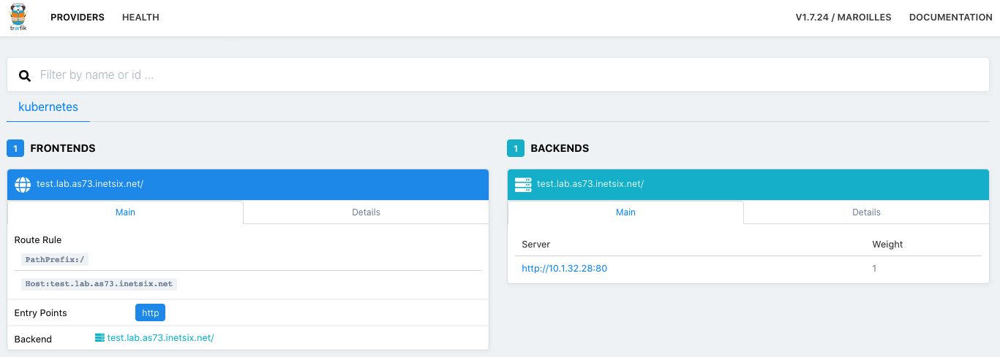

# NGINX with Ingress based on vhost

## Description

Deploy an NGINX pod and allow access from outside using traefik as ingress controller using virtual host.

## Deploy content

### Create deployment

```yaml
apiVersion: apps/v1
kind: Deployment
metadata:
  name: nginx-basics
spec:
  selector:
    matchLabels:
      app: webui
  replicas: 1
  template:
    metadata:
      labels:
        app: webui
    spec:
      containers:
      - name: nginx
        image: nginx
        ports:
        - containerPort: 80
```

### Expose service

Service is only available with `ClusterIP` and could not be reached from outside.

```yaml
---
apiVersion: v1
kind: Service
metadata:
  labels:
    app: nginx
  name: nginx-basics
spec:
  ports:
  - port: 80
    protocol: TCP
    targetPort: 80
  selector:
    app: webui
  type: ClusterIP
```

### Create Ingress

```yaml
---
apiVersion: networking.k8s.io/v1beta1
kind: Ingress
metadata:
  name: nginx-basics
spec:
  rules:
  - host: test.lab.as73.inetsix.net
    http:
      paths:
      - path: /
        backend:
          serviceName: nginx-basics
          servicePort: 80
```

Host __MUST__ be changed according your own setup. [nip.io](https://nip.io) might provide a solution to create your host

### Use buil-in manifest

```
$ kubectl apply -f manifest/deploy-nginx-basic.yml
deployment.apps/nginx-basics created
service/nginx-basic created
ingress.networking.k8s.io/nginx-basics created
```

## Check result

### Traefik validation



### From shell

- Shell in Kubernetes using SVC name

```shell
k8s-journey on  master [✘+?] at ☸️  microk8s
➜ kalpine
If you don't see a command prompt, try pressing enter.
/ # apk add curl
fetch http://dl-cdn.alpinelinux.org/alpine/v3.12/main/x86_64/APKINDEX.tar.gz
fetch http://dl-cdn.alpinelinux.org/alpine/v3.12/community/x86_64/APKINDEX.tar.gz
(1/4) Installing ca-certificates (20191127-r4)
(2/4) Installing nghttp2-libs (1.41.0-r0)
(3/4) Installing libcurl (7.69.1-r0)
(4/4) Installing curl (7.69.1-r0)
Executing busybox-1.31.1-r16.trigger
Executing ca-certificates-20191127-r4.trigger
OK: 7 MiB in 18 packages
/ # curl nginx-basics
<!DOCTYPE html>
<html>
<head>
<title>Welcome to nginx!</title>
<style>
    body {
        width: 35em;
        margin: 0 auto;
        font-family: Tahoma, Verdana, Arial, sans-serif;
    }
</style>
</head>
<body>
<h1>Welcome to nginx!</h1>
<p>If you see this page, the nginx web server is successfully installed and
working. Further configuration is required.</p>

<p>For online documentation and support please refer to
<a href="http://nginx.org/">nginx.org</a>.<br/>
Commercial support is available at
<a href="http://nginx.com/">nginx.com</a>.</p>

<p><em>Thank you for using nginx.</em></p>
</body>
</html>
```

- Shell in Kubernetes using SVC name

```shell
/ # curl test.lab.as73.inetsix.net
<!DOCTYPE html>
<html>
<head>
<title>Welcome to nginx!</title>
<style>
    body {
        width: 35em;
        margin: 0 auto;
        font-family: Tahoma, Verdana, Arial, sans-serif;
    }
</style>
</head>
<body>
<h1>Welcome to nginx!</h1>
<p>If you see this page, the nginx web server is successfully installed and
working. Further configuration is required.</p>

<p>For online documentation and support please refer to
<a href="http://nginx.org/">nginx.org</a>.<br/>
Commercial support is available at
<a href="http://nginx.com/">nginx.com</a>.</p>

<p><em>Thank you for using nginx.</em></p>
</body>
</html>
```

- Shell from laptop

```shell
@tomcat ➜ ~  curl test.lab.as73.inetsix.net
<!DOCTYPE html>
<html>
<head>
<title>Welcome to nginx!</title>
<style>
    body {
        width: 35em;
        margin: 0 auto;
        font-family: Tahoma, Verdana, Arial, sans-serif;
    }
</style>
</head>
<body>
<h1>Welcome to nginx!</h1>
<p>If you see this page, the nginx web server is successfully installed and
working. Further configuration is required.</p>

<p>For online documentation and support please refer to
<a href="http://nginx.org/">nginx.org</a>.<br/>
Commercial support is available at
<a href="http://nginx.com/">nginx.com</a>.</p>

<p><em>Thank you for using nginx.</em></p>
</body>
</html>
```


## Check Kubernetes status

### Check deployment

```shell
$ kubectl get deployments
NAME                READY   UP-TO-DATE   AVAILABLE   AGE
nginx-basics        1/1     1            1           28m
```

And get more details:

```
$ kubectl describe deployments.apps nginx-basics
Name:                   nginx-basics
Namespace:              default
CreationTimestamp:      Tue, 23 Jun 2020 12:18:05 +0200
Labels:                 <none>
Annotations:            deployment.kubernetes.io/revision: 1
                        kubectl.kubernetes.io/last-applied-configuration:
                          {"apiVersion":"apps/v1","kind":"Deployment","metadata":{"annotations":{},"name":"nginx-basics","namespace":"default"},"spec":{"replicas":1...
Selector:               app=webui
Replicas:               1 desired | 1 updated | 1 total | 1 available | 0 unavailable
StrategyType:           RollingUpdate
MinReadySeconds:        0
RollingUpdateStrategy:  25% max unavailable, 25% max surge
Pod Template:
  Labels:  app=webui
  Containers:
   nginx:
    Image:        nginx
    Port:         80/TCP
    Host Port:    0/TCP
    Environment:  <none>
    Mounts:       <none>
  Volumes:        <none>
Conditions:
  Type           Status  Reason
  ----           ------  ------
  Progressing    True    NewReplicaSetAvailable
  Available      True    MinimumReplicasAvailable
OldReplicaSets:  <none>
NewReplicaSet:   nginx-basics-8c54c7598 (1/1 replicas created)
Events:
  Type    Reason             Age   From                   Message
  ----    ------             ----  ----                   -------
  Normal  ScalingReplicaSet  30m   deployment-controller  Scaled up replica set nginx-basics-8c54c7598 to 1
  Normal  ScalingReplicaSet  29m   deployment-controller  Scaled up replica set nginx-basics-8c54c7598 to 3
  Normal  ScalingReplicaSet  29m   deployment-controller  Scaled down replica set nginx-basics-8c54c7598 to 1
```

### Check POD

```
$ kubectl get pod
NAME                                 READY   STATUS    RESTARTS   AGE
nginx-basics-8c54c7598-rd475         1/1     Running   0          34m
```

```shell
Name:         nginx-basics-8c54c7598-rd475
Namespace:    default
Priority:     0
Node:         k8s-node1/10.73.1.248
Start Time:   Tue, 23 Jun 2020 12:18:05 +0200
Labels:       app=webui
              pod-template-hash=8c54c7598
Annotations:  <none>
Status:       Running
IP:           10.1.32.28
IPs:
  IP:           10.1.32.28
Controlled By:  ReplicaSet/nginx-basics-8c54c7598
Containers:
  nginx:
    Container ID:   containerd://c738ac9d6c8d7ee00e5d56e7d422f7873c5333c3df70528367989623dbc51343
    Image:          nginx
    Image ID:       docker.io/library/nginx@sha256:21f32f6c08406306d822a0e6e8b7dc81f53f336570e852e25fbe1e3e3d0d0133
    Port:           80/TCP
    Host Port:      0/TCP
    State:          Running
      Started:      Tue, 23 Jun 2020 12:18:07 +0200
    Ready:          True
    Restart Count:  0
    Environment:    <none>
    Mounts:
      /var/run/secrets/kubernetes.io/serviceaccount from default-token-tp69t (ro)
Conditions:
  Type              Status
  Initialized       True
  Ready             True
  ContainersReady   True
  PodScheduled      True
Volumes:
  default-token-tp69t:
    Type:        Secret (a volume populated by a Secret)
    SecretName:  default-token-tp69t
    Optional:    false
QoS Class:       BestEffort
Node-Selectors:  <none>
Tolerations:     node.kubernetes.io/not-ready:NoExecute for 300s
                 node.kubernetes.io/unreachable:NoExecute for 300s
Events:
  Type    Reason     Age   From                Message
  ----    ------     ----  ----                -------
  Normal  Scheduled  35m   default-scheduler   Successfully assigned default/nginx-basics-8c54c7598-rd475 to k8s-node1
  Normal  Pulling    35m   kubelet, k8s-node1  Pulling image "nginx"
  Normal  Pulled     35m   kubelet, k8s-node1  Successfully pulled image "nginx"
  Normal  Created    35m   kubelet, k8s-node1  Created container nginx
  Normal  Started    34m   kubelet, k8s-node1  Started container nginx
```

### Check Service

```shell
k get services
NAME                TYPE        CLUSTER-IP       EXTERNAL-IP   PORT(S)        AGE
kubernetes          ClusterIP   10.152.183.1     <none>        443/TCP        144m
nginx-basics        ClusterIP   10.152.183.49    <none>        80/TCP         38m
nginx-hello-world   NodePort    10.152.183.104   <none>        80:31788/TCP   41m
```

Display service details

```shell
k describe service nginx-basics
Name:              nginx-basics
Namespace:         default
Labels:            app=nginx
Annotations:       kubectl.kubernetes.io/last-applied-configuration:
                     {"apiVersion":"v1","kind":"Service","metadata":{"annotations":{},"labels":{"app":"nginx"},"name":"nginx-basics","namespace":"default"},"sp...
Selector:          app=webui
Type:              ClusterIP
IP:                10.152.183.49
Port:              <unset>  80/TCP
TargetPort:        80/TCP
Endpoints:         10.1.32.28:80
Session Affinity:  None
Events:            <none>
```

### Check ingress services

```shell
k get ingress
NAME           CLASS    HOSTS                       ADDRESS   PORTS   AGE
nginx-basics   <none>   test.lab.as73.inetsix.net             80      40m
```

```shell
k describe ingress nginx-basics
Name:             nginx-basics
Namespace:        default
Address:
Default backend:  default-http-backend:80 (<none>)
Rules:
  Host                       Path  Backends
  ----                       ----  --------
  test.lab.as73.inetsix.net
                             /   nginx-basics:80 (10.1.32.28:80)
Annotations:
  kubectl.kubernetes.io/last-applied-configuration:  {"apiVersion":"networking.k8s.io/v1beta1","kind":"Ingress","metadata":{"annotations":{},"name":"nginx-basics","namespace":"default"},"spec":{"rules":[{"host":"test.lab.as73.inetsix.net","http":{"paths":[{"backend":{"serviceName":"nginx-basics","servicePort":80},"path":"/"}]}}]}}

Events:  <none>
```